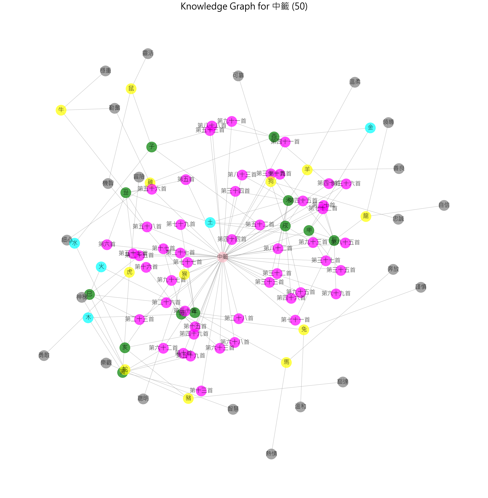
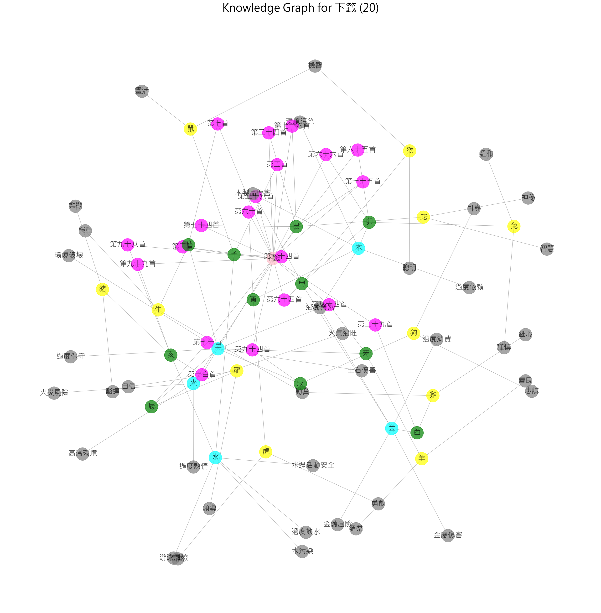
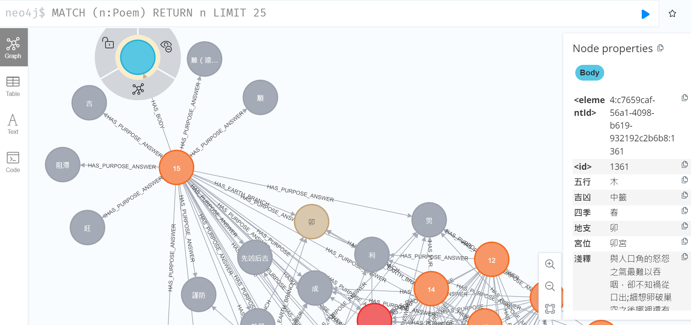
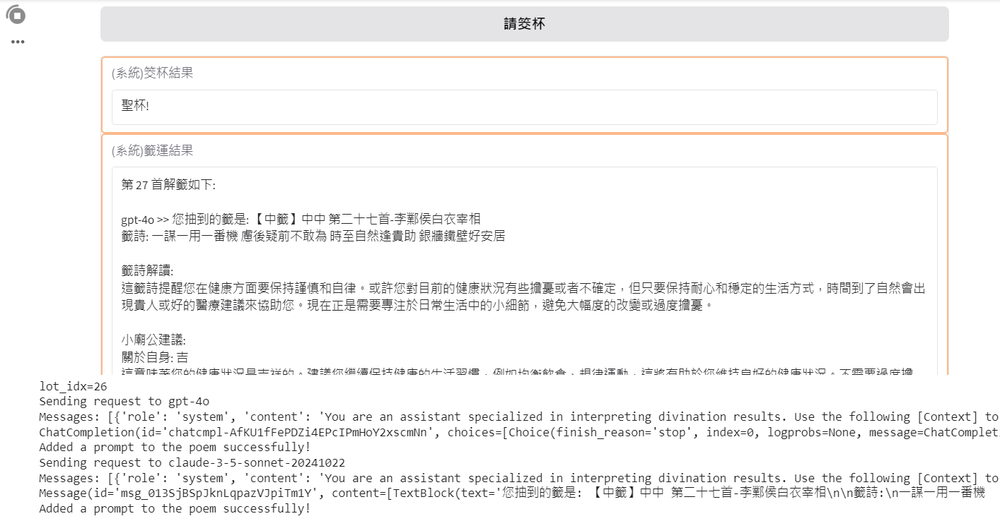

<svg xmlns="http://www.w3.org/2000/svg" viewBox="0 0 300 300">
  <!-- Background with light sketch texture -->
  <rect width="300" height="300" fill="#f5f5f5"/>
  <!-- Sketchy container/筒 with loose pencil-like strokes -->
  <path d="M100 200 L100 100 Q150 80 200 100 L200 200 Q150 220 100 200"
        fill="none"
        stroke="#3d3d3d"
        stroke-width="3"
        stroke-dasharray="5,5"/>
  <!-- Fortune sticks with varying angles -->
  <line x1="130" y1="120" x2="150" y2="50" stroke="#4a4a4a" stroke-width="2"/>
  <line x1="160" y1="130" x2="180" y2="60" stroke="#4a4a4a" stroke-width="2"/>
  <line x1="140" y1="140" x2="170" y2="70" stroke="#4a4a4a" stroke-width="2"/>
  <!-- Chinese characters with handwritten style -->
  <text x="50" y="250" font-family="SimSun, STSong" font-size="20" fill="#1a1a1a">
    <tspan x="50" dy="0">籤詩</tspan>
    <tspan x="50" dy="30">吉凶禍福</tspan>
    <tspan x="50" dy="30">平安</tspan>
  </text>
</svg>

# About Project

籤詩文化是華人社會深厚的傳統，透過神諭指引人們面對人生的困惑。本專案試圖將古老的籤詩文化與現代科技結合，利用人工智慧技術，提供使用者更便捷、更深入的解籤體驗，讓傳統文化得以在現代社會中煥發新光彩。

人工智慧技術的快速發展為各行各業帶來了革新。本專案將 AI 應用於傳統的籤詩文化中，旨在探索 AI 在文化領域的潛力。透過結合 RAG、LLM、Chatbot 與知識圖等技術，我們期望能打造一個智能化的解籤平台，輔助使用者更深入地理解籤詩。然而，由於籤詩解讀具有高度主觀性，AI 提供的結果僅供參考，不應完全作為決策的唯一依據。

注意事項：
AI 解籤的局限性： 籤詩解讀牽涉到文化、宗教、哲學等多方面因素，AI 模型雖然能提供客觀的分析，但無法完全取代人類的智慧和經驗。
使用者主觀判斷： 最終的解讀仍需結合個人的直覺、經驗和當下的處境來綜合判斷。

Fortune stick culture, deeply rooted in Chinese-speaking societies, offers divine guidance to navigate life’s uncertainties. As interpretations of fortune stick verses evolve with time, this project integrates this ancient tradition with modern technology. By utilizing artificial intelligence (AI), we aim to provide users with a more accessible and insightful interpretation experience, ensuring the relevance and vibrancy of this cultural practice in today’s society.

This project explores the application of AI in cultural domains, combining advanced technologies such as RAG, Large Language Models (LLMs), chatbots, and knowledge graphs. Our goal is to create an intelligent platform that not only delivers precise textual interpretations but also fosters interactive exploration of the deeper meanings behind fortune sticks.

"In several APEC cultures, including Chinese, Japanese, and Korean, people visit temples and draw fortune sticks for guidance. These sticks contain cryptic verses offering insights into various aspects of life, such as health, career, and relationships. This project leverages Retrieval-Augmented Generation (RAG) and LLMs to provide diverse interpretations. However, personal reflection remains key, with AI serving as a complementary tool."

---

# About Graph+RAG

**Dynamic Graph Updates with User Interactions**

When users ask questions, the graph dynamically updates in real time.

For example, after interacting with the system, **Poem #27** now has two additional `HAS_PROMPT` **UserPrompt** nodes linked to their corresponding **LLM** nodes via the `GENERATED_BY` relationship. These nodes also include `purpose_embedding` and `answer_embedding` data, which are used for similarity-based searches.

You can perform a similarity search (e.g., top 1 to 3 matches, based on your preference) within the same poem's questions. If a match exceeds a similarity threshold (e.g., `0.75`), the system can return the existing LLM response directly.


---

# Preprocessing

### 1. **Web Crawler**

1.1 Use a web crawler to collect data on 100 poems, including their text and images.

> Implementation: [step1-bless_u_crawler](./pre-process/step1-bless_u_crawler.ipynb)

1.2 The output includes the JSON file [all_chances.json](./data/all_chances.json) and a knowledge graph overview generated using NetworkX.

### **Poem Categories**

- **Good Poems**: 30 poems in total.
  
- **Normal Poems**: 50 poems in total.
  
- **Bad Poems**: 20 poems in total.
  

---

### 2. **LLM for Expanded Poem Interpretations**

2.1 Generate additional `UserPrompt` data using LLMs by specifying parameters such as `model`, `temperature`, and `max_tokens`. This step is optional; the system can auto-generate prompts at runtime during user interaction.

> Implementation: [step2-bless_u_LLM-poem-answers-gen](./pre-process/step2-bless_u_LLM-poem-answers-gen.ipynb)

> **Note**: If you encounter API issues, verify your `API_KEY` and ensure sufficient credits. Use [tool-bless_u_LLM-api-test](./pre-process/tool-bless_u_LLM-api-test.ipynb) for troubleshooting.

2.2 Intermediate output is stored in [all_contexts.json](./data/all_contexts.json).

---

### 3. **Export to Neo4j Graph Database**

3.1 Export poem data and their extended knowledge relationships into a Neo4j graph database.

> Implementation: [step3-bless_u_neo4j](./pre-process/step3-bless_u_neo4j.ipynb)

3.2 Verify the graph structure in the Neo4j dashboard. Below is an example showing Poem #15 and its relations:


---

### 4. **Graph Design Concepts**

4.1 Key Cypher queries illustrate node-edge-node relationships for poems in Neo4j:

### Create Initial Graph

```cypher
CREATE (p1:Poem {number: 1, name: "第一首", ...})
-[:HAS_BODY]->(s1:Body {籤詩: "籤詩x4", 吉凶: "上籤", ...})
-[:HAS_EARTH_BRANCH]->(e1:EarthlyBranch {name: "子", ...})
-[:HAS_PURPOSE]->(i1:DivineIntention {purpose: "疾病", purpose_embedding: [], ...})
-[:HAS_PURPOSE_ANSWER]->(a1:PurposeAnswer {purpose: '疾病', answer: "'有驚'", answer_embedding: [], ...})
WITH p1, e1
MERGE (e1)-[:HAS_FIVE_ELEMENT]->(f1:FiveElement {name: "水"})
MERGE (e1)-[:HAS_ZODIAC]->(z1:Zodiac {name: "鼠"})
```

### Add User Prompt and LLM Info

```cypher
MATCH (p:Poem {number: $poem_number})
CREATE (up:UserPrompt {text: "求身體健康", llm_response: "good luck!", purpose_embedding: [], llm_response_embedding: []...})
-[:GENERATED_BY]->(l:LLM {model: $model, temperature: $temperature, max_tokens: $max_tokens})
CREATE (p)-[:HAS_PROMPT]->(up)
```

### Simple Search

```cypher
MATCH (p:Poem {number: 1})
MATCH (p)-[:HAS_BODY]->(b)
MATCH (p)-[:HAS_PURPOSE]->(i)
MATCH (i)-[:HAS_PURPOSE_ANSWER]->(a)
MATCH (p)-[:HAS_EARTH_BRANCH]->(e)
MATCH (e)-[:HAS_FIVE_ELEMENTS]->(f)
MATCH (e)-[:HAS_ZODIAC]->(z)
RETURN p.name, b.籤名, i.purpose, a.answer, e.name as 地支, f.name as 五行, z.name as 生肖, ...
```

### Similarity Search

```cypher
MATCH (p:Poem {number: 1})-[:HAS_PROMPT]->(up:UserPrompt)
OPTIONAL MATCH (up)-[:GENERATED_BY]->(llm:LLM)
WITH up, llm, gds.similarity.cosine(up.purpose_embedding, $new_userprompt_embedding) AS similarity
WHERE similarity > 0.75
RETURN similarity, up.llm_response, llm.model...
ORDER BY similarity DESC
LIMIT 3
```

---

# Launch the Web UI

### 5. **Run the Gradio App**

5.1 Execute [bless_u_chatbot_100](./bless_u_chatbot_100.ipynb) to launch a Gradio app with a 72-hour accessible weblink for testing.

### Initial Interface


### Interaction Example

Interact with the system to receive poem interpretations and ask questions:


---

**Enjoy the platform, and we look forward to your feedback!**

---
